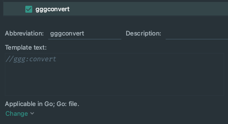

# GGG

Go generator for struct converters.

```go
package main

import (
	"strconv"
)

// From is a type you want convert from.
type From struct {
	A string
	B *string
	C string
	D *string
	E int
	F string
	G int
	H []string
}

// To is a type you want convert to.
type To struct {
	A string
	B *string
	C *string
	D string
	E int
	F int
	G string
	H []string
}

// Write a function, that would be converter.
// Its signature should contain 1 named parameter and 1 result.
// Above function write magic comment //ggg:convert

//ggg:convert
func convertFromToTo(in From) To{}

// Run `ggg -w path/to/file`
//
// Converter would appear and magic comment would be deleted.

func convertFromToTo2(in To) From {
	return From{
		A: in.A,
		B: in.B,
		C: *in.C,
		D: &in.D,
		E: in.E,
		F: strconv.Itoa(in.F),
		G: newStringFromInt(in.G), // for unknown converters it generates another convert call.
		H: in.H,
	}
}
```

### Install

```
go get -u github.com/vetcher/ggg
```

### How I use it?

In Goland [`Preferences->Tools->External Tools`](jetbrains://GoLand/settings?name=Tools--External+Tools). 
Add new tool `ggg` with Arguments: `-w $FilePath$`. 
If you want, add keyboard shortcut for new tool.

Also, in [`Preferences->Editor->Live Templates`](jetbrains://GoLand/settings?name=Editor--Live+Templates) you may add one,
that would write magic comment for you. Click `Add` add fill fields like in screenshot below.


